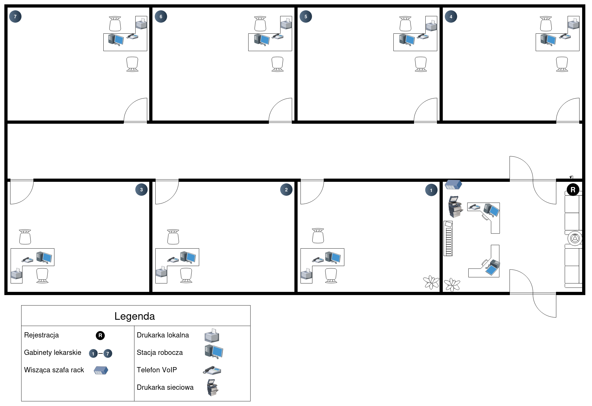

# Kosztorys i projekt sieci do przychodni

Zadanie to pochodzi z podręcznika do przygotowania do kwalifikacji INF.02 Jarosława Orczykowskiego i Artura Rudnickiego.

## Treść zadania

Stwórz kosztorys wstępny dla sieci komuterowej w przychodni lekarskiej, która mieści się w budynku parterowym o wymiarach 20x10 m podzielonym na osiem identycznych pomieszczeń - siedem z nich to gabinety lekarskie, a jeden to rejestracja. W każdym z gabinetów powinny pracować: komputer, drukarka lokalna oraz aparat telefoniczny VoIP, a w rejestracji - dwa komputery, drukarka sieciowa oraz aparat telefoniczny VoIP. Prrzychodnia nie ma wydzielonego miejsca na serwerownię. Kosztorys sporządź dla zaprojektowanego przez siebie budynku. Stwórz projekt logiczny sieci komputerowej.

## Projekt budynku

