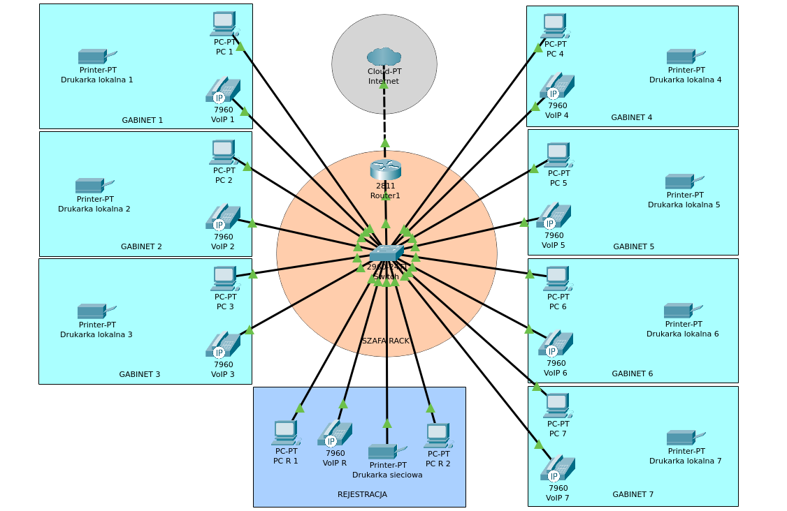

# Kosztorys i projekt sieci do przychodni

To repozytorium zawiera kosztorys, projekt budynku oraz projekt logiczny sieci komputerowej dla przychodni lekarskiej.

## Zadanie

Zadanie pochodzi z podręcznika do przygotowania do kwalifikacji INF.02 Jarosława Orczykowskiego i Artura Rudnickiego.

### Treść zadania

Stwórz kosztorys wstępny dla sieci komputerowej w przychodni lekarskiej, która mieści się w budynku parterowym o wymiarach 20x10 m podzielonym na osiem identycznych pomieszczeń – siedem z nich to gabinety lekarskie, a jeden to rejestracja.

**Wymagania:**
- W każdym gabinecie:
  - 1 komputer,
  - 1 drukarka lokalna,
  - 1 aparat telefoniczny VoIP.
- W rejestracji:
  - 2 komputery,
  - 1 drukarka sieciowa,
  - 1 aparat telefoniczny VoIP.
- Brak wydzielonej serwerowni.

---

## Zawartość repozytorium

### 1. Kosztorys
- [`kosztorys-wstepny.xlsx`](kosztorys/kosztorys-wstepny.xlsx) – wstępny kosztorys w formacie Excel.
- [`kosztorys-wstepny.pdf`](kosztorys/kosztorys-wstepny.pdf) – kosztorys w formacie PDF.

### 2. Projekt budynku
- [`projekt-przychodni.drawio`](wizualizacja/projekt-przychodni.drawio) – wizualizacja przychodni stworzona w draw.io.
- [`projekt-przychodni.png`](wizualizacja/projekt-przychodni.png) – podgląd wizualizacji w formacie PNG.

### 3. Projekt logiczny sieci
- [`przychodnia-siec.pkt`](projekt-logiczny/przychodnia-siec.pkt) – projekt logiczny sieci w Packet Tracer.
- [`diagram-logiczny.png`](projekt-logiczny/diagram-logiczny.png) - podgląd projektu w formacie PNG.

---

## Technologie i narzędzia

W trakcie realizacji projektu wykorzystano:
- **Google Sheets** – do tworzenia kosztorysu,
- **draw.io** – do projektowania wizualizacji budynku,
- **Cisco Packet Tracer** – do projektowania sieci logicznej.

---

## Jak uruchomić projekt?

1. **Kosztorys**:
   - Otwórz plik Excel (`.xlsx`) lub wersję PDF (`.pdf`), aby zapoznać się z kosztorysem.
2. **Projekt budynku**:
   - Plik `.drawio` można edytować w narzędziu [draw.io](https://app.diagrams.net/).
   - Alternatywnie, przejrzyj wizualizację w formacie PNG.
3. **Projekt logiczny sieci**:
   - Otwórz plik `.pkt` za pomocą [Cisco Packet Tracer](https://www.netacad.com/courses/packet-tracer).
   - Możesz również zobaczyć podgląd diagramu w formacie PNG.

---

## Podgląd projektu

### Wizualizacja budynku:

### Diagram logiczny sieci:

---

## Kontakt

Jeśli masz pytania lub uwagi dotyczące projektu, zapraszam do kontaktu poprzez [LinkedIn](https://linkedin.com/in/smichajlidis) lub [GitHub](https://github.com/smichajlidis).

---
